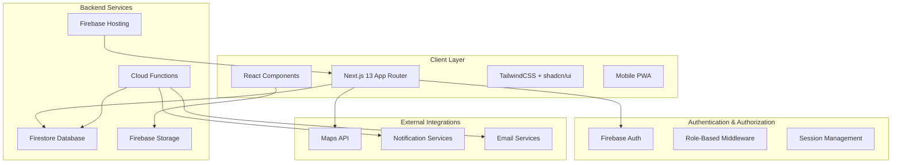
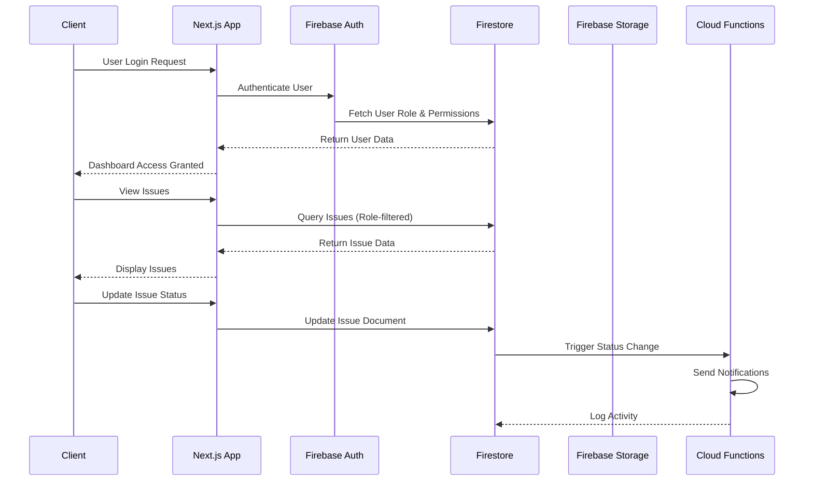

# Design Document

## Overview

The Admin Web Dashboard is a modern, responsive management portal for municipal authorities to handle crowdsourced road hazard reports from citizens. Built with Next.js 13 App Router, TypeScript, TailwindCSS, and Firebase, the system features a safety-focused design theme with professional municipal colors.

**Design Philosophy**: Clean, professional interface with safety-oriented color scheme (blues for trust, oranges/reds for hazards, greens for resolved issues) that reflects the municipal and road safety context. The UI emphasizes clarity, accessibility, and efficient workflow management for emergency response scenarios.

**Visual Theme**:

- Primary: Deep municipal blue (#1e40af) for trust and authority
- Secondary: Safety orange (#ea580c) for hazards and alerts
- Success: Road sign green (#16a34a) for completed/safe status
- Warning: Construction yellow (#eab308) for in-progress items
- Danger: Emergency red (#dc2626) for critical issues
- Neutral: Professional grays (#64748b, #f1f5f9) for backgrounds

## Architecture

### High-Level Architecture



### Technology Stack

- **Frontend Framework**: Next.js 13 with App Router and TypeScript
- **Styling**: TailwindCSS with shadcn/ui component library
- **Icons**: lucide-react for consistent iconography
- **Authentication**: Firebase Authentication with custom role management
- **Database**: Firestore for real-time data synchronization
- **File Storage**: Firebase Storage for images and documents
- **Backend Logic**: Firebase Cloud Functions for automation
- **Hosting**: Firebase Hosting with SSR support
- **Maps Integration**: Google Maps API for location visualization
- **State Management**: React Context API with custom hooks

### Data Flow Architecture



## UI/UX Design System

### Municipal Safety Theme

#### Color Palette

```css
:root {
  /* Primary - Municipal Authority Blue */
  --primary-50: #eff6ff;
  --primary-100: #dbeafe;
  --primary-500: #3b82f6;
  --primary-600: #2563eb;
  --primary-700: #1d4ed8;
  --primary-900: #1e3a8a;

  /* Secondary - Safety Orange */
  --secondary-50: #fff7ed;
  --secondary-100: #ffedd5;
  --secondary-500: #f97316;
  --secondary-600: #ea580c;
  --secondary-700: #c2410c;

  /* Success - Road Sign Green */
  --success-50: #f0fdf4;
  --success-100: #dcfce7;
  --success-500: #22c55e;
  --success-600: #16a34a;
  --success-700: #15803d;

  /* Warning - Construction Yellow */
  --warning-50: #fefce8;
  --warning-100: #fef3c7;
  --warning-500: #eab308;
  --warning-600: #ca8a04;

  /* Danger - Emergency Red */
  --danger-50: #fef2f2;
  --danger-100: #fee2e2;
  --danger-500: #ef4444;
  --danger-600: #dc2626;
  --danger-700: #b91c1c;

  /* Neutral - Professional Grays */
  --gray-50: #f8fafc;
  --gray-100: #f1f5f9;
  --gray-200: #e2e8f0;
  --gray-300: #cbd5e1;
  --gray-400: #94a3b8;
  --gray-500: #64748b;
  --gray-600: #475569;
  --gray-700: #334155;
  --gray-800: #1e293b;
  --gray-900: #0f172a;
}
```

#### Typography Scale

```css
/* Municipal-focused typography */
.text-display {
  font-family: 'Inter', system-ui, sans-serif;
  font-weight: 700;
  font-size: 2.25rem;
  line-height: 1.2;
  letter-spacing: -0.025em;
}

.text-heading {
  font-family: 'Inter', system-ui, sans-serif;
  font-weight: 600;
  font-size: 1.5rem;
  line-height: 1.3;
}

.text-body {
  font-family: 'Inter', system-ui, sans-serif;
  font-weight: 400;
  font-size: 0.875rem;
  line-height: 1.5;
}

.text-caption {
  font-family: 'Inter', system-ui, sans-serif;
  font-weight: 500;
  font-size: 0.75rem;
  line-height: 1.4;
  text-transform: uppercase;
  letter-spacing: 0.05em;
}
```

#### Component Design Patterns

**Status Indicators**

```typescript
const statusConfig = {
  pending: {
    color: 'warning',
    icon: 'Clock',
    label: 'Pending Review',
    bgClass: 'bg-warning-50 text-warning-700 border-warning-200',
  },
  in_progress: {
    color: 'primary',
    icon: 'Wrench',
    label: 'In Progress',
    bgClass: 'bg-primary-50 text-primary-700 border-primary-200',
  },
  resolved: {
    color: 'success',
    icon: 'CheckCircle',
    label: 'Resolved',
    bgClass: 'bg-success-50 text-success-700 border-success-200',
  },
  escalated: {
    color: 'danger',
    icon: 'AlertTriangle',
    label: 'Escalated',
    bgClass: 'bg-danger-50 text-danger-700 border-danger-200',
  },
};
```

**Priority Indicators**

```typescript
const priorityConfig = {
  low: {
    color: 'gray',
    icon: 'Minus',
    pulse: false,
    bgClass: 'bg-gray-100 text-gray-600',
  },
  medium: {
    color: 'warning',
    icon: 'Equal',
    pulse: false,
    bgClass: 'bg-warning-100 text-warning-600',
  },
  high: {
    color: 'secondary',
    icon: 'ChevronUp',
    pulse: true,
    bgClass: 'bg-secondary-100 text-secondary-600',
  },
  critical: {
    color: 'danger',
    icon: 'AlertCircle',
    pulse: true,
    bgClass: 'bg-danger-100 text-danger-600 animate-pulse',
  },
};
```

### Responsive Layout System

#### Breakpoint Strategy

```css
/* Mobile-first responsive design */
.container {
  width: 100%;
  margin: 0 auto;
  padding: 0 1rem;
}

@media (min-width: 640px) {
  .container {
    max-width: 640px;
    padding: 0 1.5rem;
  }
}

@media (min-width: 768px) {
  .container {
    max-width: 768px;
  }
}

@media (min-width: 1024px) {
  .container {
    max-width: 1024px;
    padding: 0 2rem;
  }
}

@media (min-width: 1280px) {
  .container {
    max-width: 1280px;
  }
}
```

#### Dashboard Layout

```typescript
interface DashboardLayout {
  sidebar: {
    width: '280px';
    collapsedWidth: '64px';
    breakpoint: 'lg';
    overlay: true; // mobile
  };
  header: {
    height: '64px';
    sticky: true;
    shadow: 'sm';
  };
  main: {
    padding: '24px';
    maxWidth: '100%';
    overflow: 'auto';
  };
}
```

### Dark/Light Theme Implementation

#### Theme Toggle System

```typescript
interface ThemeConfig {
  light: {
    background: 'bg-gray-50';
    surface: 'bg-white';
    text: 'text-gray-900';
    textSecondary: 'text-gray-600';
    border: 'border-gray-200';
  };
  dark: {
    background: 'bg-gray-900';
    surface: 'bg-gray-800';
    text: 'text-gray-100';
    textSecondary: 'text-gray-300';
    border: 'border-gray-700';
  };
}
```

## Components and Interfaces

### Core Components Structure

```
src/
├── app/
│   ├── (auth)/
│   │   ├── login/page.tsx
│   │   └── layout.tsx
│   ├── dashboard/
│   │   ├── page.tsx (role-based redirect)
│   │   ├── super-admin/
│   │   │   ├── page.tsx
│   │   │   ├── users/page.tsx
│   │   │   └── system/page.tsx
│   │   ├── city-engineer/
│   │   │   ├── page.tsx
│   │   │   ├── issues/page.tsx
│   │   │   └── escalations/page.tsx
│   │   ├── field-supervisor/
│   │   │   ├── page.tsx
│   │   │   ├── mobile/page.tsx
│   │   │   └── assignments/page.tsx
│   │   └── auditor/
│   │       ├── page.tsx
│   │       ├── reports/page.tsx
│   │       └── compliance/page.tsx
│   ├── issues/
│   │   ├── [id]/
│   │   │   ├── page.tsx
│   │   │   └── edit/page.tsx
│   │   └── map/page.tsx
│   ├── analytics/
│   │   ├── page.tsx
│   │   ├── performance/page.tsx
│   │   └── heatmap/page.tsx
│   ├── reports/
│   │   ├── page.tsx
│   │   └── export/page.tsx
│   └── layout.tsx
├── components/
│   ├── ui/ (shadcn/ui with municipal theme)
│   │   ├── button.tsx
│   │   ├── card.tsx
│   │   ├── badge.tsx
│   │   ├── table.tsx
│   │   ├── chart.tsx
│   │   └── map.tsx
│   ├── layout/
│   │   ├── Sidebar.tsx
│   │   ├── Header.tsx
│   │   ├── MobileNav.tsx
│   │   └── ThemeToggle.tsx
│   ├── dashboard/
│   │   ├── StatsGrid.tsx
│   │   ├── IssueOverview.tsx
│   │   ├── QuickActions.tsx
│   │   └── RecentActivity.tsx
│   ├── issues/
│   │   ├── IssueTable.tsx
│   │   ├── IssueCard.tsx
│   │   ├── IssueDetails.tsx
│   │   ├── StatusBadge.tsx
│   │   ├── PriorityIndicator.tsx
│   │   ├── AssignmentPanel.tsx
│   │   └── WorkflowActions.tsx
│   ├── maps/
│   │   ├── InteractiveMap.tsx
│   │   ├── IssueMarkers.tsx
│   │   ├── HeatmapLayer.tsx
│   │   └── LocationPicker.tsx
│   ├── analytics/
│   │   ├── PerformanceCharts.tsx
│   │   ├── SLAMetrics.tsx
│   │   ├── TrendAnalysis.tsx
│   │   └── AreaComparison.tsx
│   ├── auth/
│   │   ├── LoginForm.tsx
│   │   ├── ProtectedRoute.tsx
│   │   └── RoleGuard.tsx
│   └── common/
│       ├── LoadingSpinner.tsx
│       ├── ErrorBoundary.tsx
│       ├── NotificationToast.tsx
│       └── ConfirmDialog.tsx
├── lib/
│   ├── firebase/
│   │   ├── config.ts
│   │   ├── auth.ts
│   │   ├── firestore.ts
│   │   ├── storage.ts
│   │   └── functions.ts
│   ├── hooks/
│   │   ├── useAuth.ts
│   │   ├── useIssues.ts
│   │   ├── useRealtime.ts
│   │   └── usePermissions.ts
│   ├── utils/
│   │   ├── permissions.ts
│   │   ├── formatting.ts
│   │   ├── validation.ts
│   │   └── constants.ts
│   └── types/
│       ├── auth.ts
│       ├── issues.ts
│       ├── users.ts
│       └── analytics.ts
└── styles/
    ├── globals.css
    └── municipal-theme.css
```

### Key Component Interfaces

#### Authentication Components

- **LoginForm**: Firebase email/password authentication
- **ProtectedRoute**: Role-based route protection middleware
- **RoleGuard**: Component-level permission checking
- **AuthProvider**: Context provider for authentication state

#### Dashboard Components

**Modern Dashboard Interface Design**

```typescript
// Role-specific dashboard layouts with municipal theme
interface DashboardConfig {
  superAdmin: {
    layout: 'grid-cols-1 lg:grid-cols-4';
    widgets: [
      'SystemHealth',
      'UserActivity',
      'IssueOverview',
      'PerformanceMetrics',
    ];
    quickActions: ['AddUser', 'SystemSettings', 'BackupData', 'ViewReports'];
  };
  cityEngineer: {
    layout: 'grid-cols-1 lg:grid-cols-3';
    widgets: [
      'ActiveIssues',
      'SLAStatus',
      'AreaPerformance',
      'EscalationQueue',
    ];
    quickActions: ['AssignIssue', 'CreateReport', 'ViewMap', 'ManageAreas'];
  };
  fieldSupervisor: {
    layout: 'grid-cols-1 md:grid-cols-2';
    widgets: ['MyAssignments', 'TodaysTasks', 'CompletionRate', 'LocationMap'];
    quickActions: ['UpdateStatus', 'UploadPhoto', 'RequestHelp', 'ViewRoute'];
    mobileOptimized: true;
  };
  auditor: {
    layout: 'grid-cols-1 lg:grid-cols-2';
    widgets: [
      'ComplianceMetrics',
      'AuditTrail',
      'PerformanceTrends',
      'ExportCenter',
    ];
    quickActions: [
      'GenerateReport',
      'ExportData',
      'ViewAnalytics',
      'ScheduleAudit',
    ];
  };
}
```

**Key Dashboard Components:**

- **StatsGrid**: Animated metric cards with trend indicators and municipal color coding
- **IssueOverview**: Real-time issue feed with priority-based visual hierarchy
- **InteractiveMap**: Google Maps integration with custom municipal markers and heatmap layers
- **QuickActions**: Role-based action buttons with safety-themed icons
- **NotificationCenter**: Toast notifications with emergency alert styling
- **RecentActivity**: Timeline view of system activities with user avatars and action icons

#### Issue Management Components

- **IssueCard**: Individual issue display component
- **IssueDetails**: Comprehensive issue view with history
- **StatusUpdater**: Workflow status management
- **AssignmentManager**: User and area assignment interface
- **CommentSystem**: Internal notes and communication

#### Analytics Components

- **ChartContainer**: Reusable chart wrapper
- **PerformanceMetrics**: SLA and efficiency tracking
- **HeatmapVisualization**: Geographic issue density
- **TrendAnalysis**: Time-series data visualization
- **ExportManager**: Report generation and download

### Firebase Integration Interfaces

#### Firestore Collections Structure

```typescript
// Users Collection - Municipal Authority Users
interface User {
  id: string;
  email: string;
  displayName: string;
  role: 'super_admin' | 'city_engineer' | 'field_supervisor' | 'auditor';
  department: string;
  phone?: string;
  assignedAreas: string[];
  permissions: Permission[];
  isActive: boolean;
  createdAt: Timestamp;
  lastLogin: Timestamp;
  profileImage?: string;
  workSchedule?: WorkSchedule;
}

// Citizens Collection - App Users Who Report Issues
interface Citizen {
  id: string;
  email?: string;
  phone?: string;
  displayName?: string;
  isAnonymous: boolean;
  reportCount: number;
  verificationStatus: 'unverified' | 'phone_verified' | 'email_verified';
  createdAt: Timestamp;
  lastReportAt?: Timestamp;
}

// Issues Collection - Road Hazard Reports
interface Issue {
  id: string;
  title: string;
  description: string;
  status: 'pending' | 'in_progress' | 'resolved' | 'escalated' | 'closed';
  priority: 'low' | 'medium' | 'high' | 'critical';
  category:
    | 'pothole'
    | 'street_light'
    | 'water_leak'
    | 'traffic_signal'
    | 'sidewalk'
    | 'drainage'
    | 'debris'
    | 'other';
  severity: 'minor' | 'moderate' | 'major' | 'critical';
  location: GeoPoint;
  address: {
    street: string;
    city: string;
    state: string;
    zipCode: string;
    landmark?: string;
  };
  reportedBy: string; // Citizen ID
  assignedTo?: string; // Authority User ID
  images: string[]; // Firebase Storage URLs
  createdAt: Timestamp;
  updatedAt: Timestamp;
  resolvedAt?: Timestamp;
  slaDeadline: Timestamp;
  area: string;
  tags: string[];
  estimatedCost?: number;
  actualCost?: number;
  contractorId?: string;
  citizenFeedback?: CitizenFeedback;
}

// Activities Collection - Audit Trail
interface Activity {
  id: string;
  issueId: string;
  userId: string;
  userRole: string;
  action:
    | 'created'
    | 'assigned'
    | 'status_changed'
    | 'commented'
    | 'resolved'
    | 'escalated'
    | 'photo_added';
  details: Record<string, any>;
  timestamp: Timestamp;
  ipAddress?: string;
}

// Notifications Collection
interface Notification {
  id: string;
  recipientId: string;
  recipientType: 'citizen' | 'authority';
  type:
    | 'issue_created'
    | 'status_updated'
    | 'assignment_changed'
    | 'sla_warning'
    | 'resolution_confirmed';
  title: string;
  message: string;
  issueId?: string;
  isRead: boolean;
  createdAt: Timestamp;
  channels: ('email' | 'sms' | 'push')[];
  deliveryStatus: Record<string, 'pending' | 'sent' | 'delivered' | 'failed'>;
}

// Areas Collection - Geographic Management Zones
interface Area {
  id: string;
  name: string;
  type: 'district' | 'neighborhood' | 'zone';
  boundaries: GeoPoint[];
  population: number;
  priority: 'high' | 'medium' | 'low';
  supervisorId?: string;
  slaTargets: Record<string, number>; // category -> hours
  activeIssues: number;
  totalIssues: number;
  averageResolutionTime: number;
}
```

#### Firebase Storage Structure

```
/hazard-reports/
  /{issueId}/
    /citizen-photos/
      - {timestamp}_original.jpg
      - {timestamp}_compressed.jpg
      - {timestamp}_thumbnail.jpg
    /authority-photos/
      - before_{timestamp}.jpg
      - progress_{timestamp}.jpg
      - completed_{timestamp}.jpg
    /documents/
      - work_order.pdf
      - cost_estimate.pdf
      - completion_certificate.pdf

/user-profiles/
  /authorities/
    /{userId}/
      - profile_image.jpg
  /citizens/
    /{citizenId}/
      - avatar.jpg

/reports/
  /performance/
    /{year}/
      /{month}/
        - monthly_performance.pdf
        - sla_compliance.csv
        - area_analysis.xlsx
  /compliance/
    /{year}/
      - annual_audit.pdf
      - quarterly_review.pdf

/system/
  /exports/
    /{timestamp}/
      - issues_export.csv
      - user_activity.json
      - analytics_data.xlsx
```

## Data Models

### Core Data Models

#### User Management

```typescript
interface UserRole {
  id: string;
  name: string;
  permissions: Permission[];
  description: string;
}

interface Permission {
  resource: string; // 'issues', 'users', 'reports', etc.
  actions: ('create' | 'read' | 'update' | 'delete')[];
  conditions?: Record<string, any>; // Role-specific conditions
}

interface Department {
  id: string;
  name: string;
  slaTargets: SLATarget[];
  supervisorId: string;
  areas: string[];
}
```

#### Issue Management

```typescript
interface IssueWorkflow {
  currentStatus: IssueStatus;
  allowedTransitions: IssueStatus[];
  requiredFields: string[];
  notifications: NotificationRule[];
}

interface SLATarget {
  priority: IssuePriority;
  category: IssueCategory;
  targetHours: number;
  escalationHours: number;
}

interface NotificationRule {
  trigger: 'status_change' | 'assignment' | 'sla_breach' | 'escalation';
  recipients: ('reporter' | 'assignee' | 'supervisor' | 'manager')[];
  template: string;
  channels: ('email' | 'sms' | 'push')[];
}
```

#### Analytics and Reporting

```typescript
interface PerformanceMetrics {
  userId: string;
  period: DateRange;
  issuesAssigned: number;
  issuesResolved: number;
  averageResolutionTime: number;
  slaCompliance: number;
  citizenSatisfaction: number;
}

interface AreaMetrics {
  areaId: string;
  period: DateRange;
  totalIssues: number;
  resolvedIssues: number;
  averageResolutionTime: number;
  hotspots: GeoPoint[];
  categoryBreakdown: Record<IssueCategory, number>;
}
```

### Database Schema Design

#### Firestore Security Rules

```javascript
rules_version = '2';
service cloud.firestore {
  match /databases/{database}/documents {
    // Users can only read their own profile
    match /users/{userId} {
      allow read, write: if request.auth != null && request.auth.uid == userId;
      allow read: if request.auth != null &&
        get(/databases/$(database)/documents/users/$(request.auth.uid)).data.role in ['super_admin', 'city_engineer'];
    }

    // Issues access based on role and area assignment
    match /issues/{issueId} {
      allow read: if request.auth != null;
      allow write: if request.auth != null &&
        (get(/databases/$(database)/documents/users/$(request.auth.uid)).data.role in ['super_admin', 'city_engineer', 'field_supervisor']);
    }

    // Activities are read-only for audit purposes
    match /activities/{activityId} {
      allow read: if request.auth != null;
      allow create: if request.auth != null;
    }
  }
}
```

#### Firestore Indexes

```javascript
// Composite indexes for efficient querying
{
  "indexes": [
    {
      "collectionGroup": "issues",
      "queryScope": "COLLECTION",
      "fields": [
        {"fieldPath": "area", "order": "ASCENDING"},
        {"fieldPath": "status", "order": "ASCENDING"},
        {"fieldPath": "createdAt", "order": "DESCENDING"}
      ]
    },
    {
      "collectionGroup": "issues",
      "queryScope": "COLLECTION",
      "fields": [
        {"fieldPath": "assignedTo", "order": "ASCENDING"},
        {"fieldPath": "status", "order": "ASCENDING"},
        {"fieldPath": "priority", "order": "DESCENDING"}
      ]
    }
  ]
}
```

## Error Handling

### Client-Side Error Handling

#### Error Boundary Implementation

```typescript
interface ErrorBoundaryState {
  hasError: boolean;
  error?: Error;
  errorInfo?: ErrorInfo;
}

class DashboardErrorBoundary extends Component<Props, ErrorBoundaryState> {
  // Catch JavaScript errors anywhere in child component tree
  // Log errors to Firebase Analytics
  // Display fallback UI with retry options
  // Provide error reporting mechanism
}
```

#### API Error Handling Strategy

```typescript
interface APIError {
  code: string;
  message: string;
  details?: Record<string, any>;
  timestamp: Date;
}

// Centralized error handling for Firebase operations
class FirebaseErrorHandler {
  static handleAuthError(error: FirebaseError): UserFriendlyError;
  static handleFirestoreError(error: FirebaseError): UserFriendlyError;
  static handleStorageError(error: FirebaseError): UserFriendlyError;
}
```

### Server-Side Error Handling

#### Cloud Functions Error Management

```typescript
// Structured error responses
interface CloudFunctionError {
  success: false;
  error: {
    code: string;
    message: string;
    details?: any;
  };
  timestamp: string;
}

// Retry mechanisms for critical operations
const retryConfig = {
  maxRetries: 3,
  backoffMultiplier: 2,
  initialDelay: 1000,
};
```

#### Monitoring and Alerting

- Firebase Performance Monitoring for client-side performance
- Cloud Functions monitoring for backend operations
- Custom metrics for business logic (SLA compliance, resolution times)
- Error aggregation and alerting through Firebase Crashlytics
- Real-time monitoring dashboard for system health

### Offline Handling

#### Progressive Web App Features

```typescript
// Service Worker for offline functionality
interface OfflineCapabilities {
  cacheStrategy: 'cache-first' | 'network-first' | 'stale-while-revalidate';
  syncWhenOnline: boolean;
  offlineIndicator: boolean;
  queuedActions: OfflineAction[];
}

// Background sync for critical operations
interface OfflineAction {
  type: 'status_update' | 'comment_add' | 'assignment_change';
  payload: any;
  timestamp: Date;
  retryCount: number;
}
```

## Testing Strategy

### Unit Testing

- **Component Testing**: React Testing Library for UI components
- **Hook Testing**: Custom hooks testing with React Hooks Testing Library
- **Utility Testing**: Jest for utility functions and data transformations
- **Firebase Rules Testing**: Firebase Emulator Suite for security rules

### Integration Testing

- **API Integration**: Firebase Emulator for end-to-end Firebase operations
- **Authentication Flow**: Complete login/logout and role-based access testing
- **Data Flow Testing**: Issue creation, assignment, and resolution workflows
- **Real-time Updates**: Firestore listener and notification testing

### End-to-End Testing

- **User Journey Testing**: Playwright for complete user workflows
- **Cross-browser Testing**: Automated testing across Chrome, Firefox, Safari
- **Mobile Responsiveness**: Testing on various device sizes and orientations
- **Performance Testing**: Lighthouse CI for performance regression detection

### Mobile-First Design Strategy

#### Field Supervisor Mobile Interface

```typescript
interface MobileInterface {
  navigation: {
    type: 'bottom-tabs';
    items: ['Dashboard', 'Assignments', 'Camera', 'Map', 'Profile'];
    safeArea: true;
    hapticFeedback: true;
  };

  gestures: {
    swipeToRefresh: true;
    pullToUpdate: true;
    swipeActions: ['complete', 'reassign', 'escalate'];
    longPressActions: ['quickUpdate', 'addNote'];
  };

  offline: {
    cacheStrategy: 'assignments-first';
    syncIndicator: true;
    queuedActions: true;
    offlineNotification: true;
  };
}
```

#### Progressive Web App Features

```typescript
interface PWAConfig {
  manifest: {
    name: 'Municipal Hazard Dashboard';
    shortName: 'HazardAdmin';
    themeColor: '#1e40af';
    backgroundColor: '#f8fafc';
    display: 'standalone';
    orientation: 'portrait-primary';
  };

  serviceWorker: {
    caching: ['static-assets', 'api-responses', 'images'];
    backgroundSync: ['status-updates', 'photo-uploads'];
    pushNotifications: true;
  };

  installPrompt: {
    trigger: 'after-3-visits';
    platforms: ['android', 'ios', 'desktop'];
    customUI: true;
  };
}
```

#### Touch-Optimized Components

```css
/* Touch-friendly interactive elements */
.touch-target {
  min-height: 44px;
  min-width: 44px;
  padding: 12px;
  border-radius: 8px;
  transition: all 0.2s ease;
}

.touch-target:active {
  transform: scale(0.98);
  background-color: var(--primary-100);
}

/* Swipe actions for mobile */
.swipe-actions {
  display: flex;
  background: linear-gradient(
    90deg,
    var(--success-500),
    var(--warning-500),
    var(--danger-500)
  );
  border-radius: 8px;
  overflow: hidden;
}

.swipe-action {
  flex: 1;
  padding: 16px;
  color: white;
  text-align: center;
  font-weight: 600;
}
```

### Testing Environment Setup

```typescript
// Jest configuration for Firebase testing
const jestConfig = {
  testEnvironment: 'jsdom',
  setupFilesAfterEnv: ['<rootDir>/src/test/setup.ts'],
  moduleNameMapping: {
    '^@/(.*)$': '<rootDir>/src/$1',
  },
  collectCoverageFrom: [
    'src/**/*.{ts,tsx}',
    '!src/**/*.d.ts',
    '!src/test/**/*',
  ],
};

// Firebase Emulator configuration
const emulatorConfig = {
  auth: { port: 9099 },
  firestore: { port: 8080 },
  storage: { port: 9199 },
  functions: { port: 5001 },
};
```

### Performance Testing Strategy

- **Load Testing**: Simulate concurrent user sessions
- **Database Performance**: Query optimization and index effectiveness
- **Image Upload Performance**: Firebase Storage upload/download speeds
- **Real-time Performance**: Firestore listener efficiency under load
- **Mobile Performance**: Testing on low-end devices and slow networks

## Security Considerations

### Authentication Security

- Multi-factor authentication for admin roles
- Session timeout and refresh token management
- Password complexity requirements
- Account lockout after failed attempts
- Audit logging for all authentication events

### Data Security

- Field-level encryption for sensitive data
- Role-based data access controls
- Data retention policies and automated cleanup
- GDPR compliance for citizen data
- Regular security audits and penetration testing

### Infrastructure Security

- Firebase Security Rules validation
- HTTPS enforcement for all communications
- Content Security Policy (CSP) headers
- Cross-Origin Resource Sharing (CORS) configuration
- Regular dependency updates and vulnerability scanning
